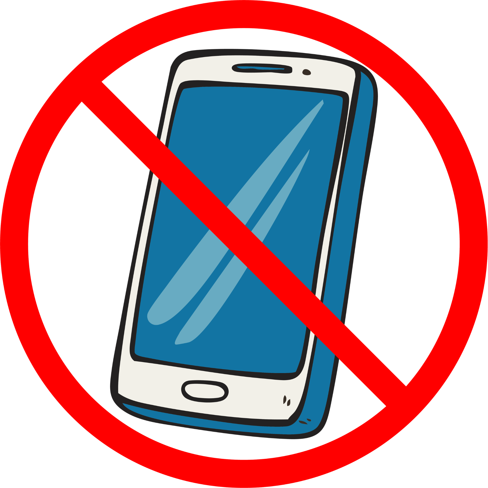
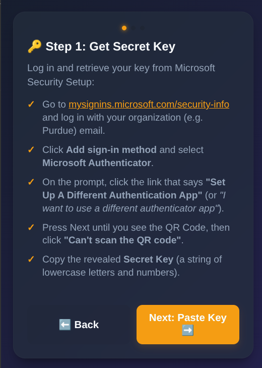
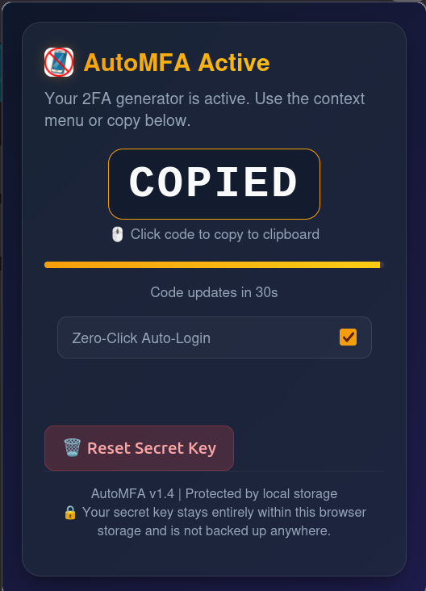

# AutoMFA

  

> [!WARNING]  
> **Disclaimer**: This browser extension codebase was generated with AI (Gemini 3.5 Flash). Users are ultimately and solely responsible for importing and executing this extension within their own browsers. By loading this software, you accept all associated security risks. This extension was tested and verified as fully functional on Google Chrome and Mozilla Firefox as of **May 2026**.

---

## What is This?

**AutoMFA** is a local-only browser extension designed to automate and simplify your Microsoft 2FA (Two-Factor Authentication) login flow. 

Instead of opening an authenticator app on your phone every time you log in, AutoMFA securely generates your verification codes offline inside your browser. It includes a smart background automation script that instantly detects Microsoft authentication prompts, chooses the verification code method, and autofills the code on your behalf in a matter of seconds.

---

## Installation

### Google Chrome
1. Download or clone this repository to a folder on your computer.
2. Open Google Chrome and navigate to `chrome://extensions/`.
3. In the top-right corner, toggle the **Developer mode** switch to **ON**.
4. In the top-left corner, click the **Load unpacked** button.
5. Select the folder containing this extension's files (where `manifest.json` is located).
6. The **AutoMFA** extension is now active! Click the puzzle icon in your toolbar to pin it for easy access if needed.

### Mozilla Firefox
1. Download or clone this repository to a folder on your computer.
2. Open Mozilla Firefox and navigate to `about:debugging#/runtime/this-firefox`.
3. Click the **Load Temporary Add-on...** button.
4. Select the `manifest.json` file inside the extension folder.
5. The **AutoMFA** extension is now active and ready to use!  You should be able to pin this to your toolbar for easy access if needed.

---

## Setup

Follow these simple steps to connect your account and enable hands-free automatic login:

1. **Get your Secret Key from Microsoft**:
   - Go to [mysignins.microsoft.com/security-info](https://mysignins.microsoft.com/security-info) and sign in with your organization (e.g. Purdue) email.
   - Click **Add sign-in method** and select **Microsoft Authenticator**.
   - Click **Next** until the **QR Code** screen appears.
   - Click the **"I want to use a different authenticator app"** or **"Can't scan the QR code"** link.
   - A alphanumeric **Secret Key** (composed of letters and numbers) will appear on screen. **Copy it**.

2. **Configure the Extension**:
   - Open the **AutoMFA** extension popup from your browser toolbar.
   - Accept the security disclaimer.
   - Interspersed navigation buttons will guide you to Step 2.
   - **Paste your Secret Key** into the input field and click **Save & Next**.
   - *Important*: Copy the 6-digit TOTP code that appears in the extension popup and paste it back into the Microsoft setup window to verify and finalize your new device.

3. **Enjoy Zero-Click Auto-Login**:
   - Once set up, the extension is active!
   - When logging in, AutoMFA will automatically watch for the MFA prompt, choose the verification code method, wait 2 seconds for the page to settle, and securely autofill the code.
   - **Toggle Feature**: If you ever want to turn off the hands-free automation, simply uncheck **Zero-Click Auto-Login** either during setup or directly from the active TOTP screen inside the popup window. Manual right-click autofilling is still available even when auto-login is disabled.
